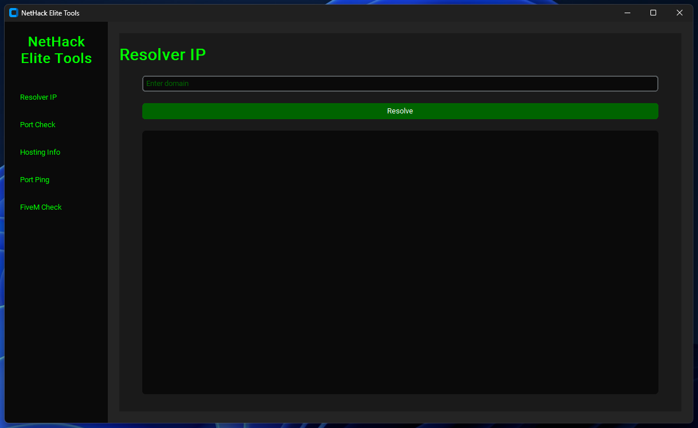

# NetHack Elite Tools

[](https://github.com/maicoldlx/nethack-elite-tools/actions)
[](https://github.com/maicoldlx/nethack-elite-tools/releases)
[](https://github.com/maicoldlx/nethack-elite-tools/releases/latest)
[](LICENSE)

NetHack Elite Tools es una aplicación de utilidades de red construida con **Python** y **CustomTkinter**. Proporciona un conjunto de herramientas para diagnóstico de redes, comprobación de servidores y obtención de información de servidores FiveM.



## 🚀 Características

- **Resolución de IP**: Resuelve nombres de dominio a direcciones IP.
- **Comprobador de Puertos**: Verifica el estado de puertos comunes (80, 443, 30120, 30121) para un host dado.
- **Información de Alojamiento**: Obtiene información del servidor para un host dado.
- **Ping de Puerto**: Realiza ping continuo a un puerto específico en un host y visualiza los tiempos de respuesta.
- **Comprobador de Servidor FiveM**: Obtiene información detallada sobre servidores FiveM utilizando su URL CFX.

## 🛠️ Instalación

### Requisitos previos

- Python 3.7 o superior
- pip (instalador de paquetes de Python)

### Pasos

1. Clona el repositorio:
   ```bash
   git clone https://github.com/maicoldlx/nethack-elite-tools.git
   cd nethack-elite-tools
   ```

2. Crea un entorno virtual (opcional pero recomendado):
   ```bash
   python -m venv venv
   source venv/bin/activate  # En Windows usa `venv\Scripts\activate`
   ```

3. Instala los paquetes requeridos:
   ```bash
   pip install -r requirements.txt
   ```

## 💻 Uso

Para ejecutar la aplicación, usa el siguiente comando en el directorio del proyecto:

```bash
python NHET.py
```

### Descripción de las Herramientas

1. **Resolver IP**: 
   - Ingresa un nombre de dominio y haz clic en "Resolver" para obtener su dirección IP.

2. **Comprobar Puertos**:
   - Ingresa un dominio o dirección IP y haz clic en "Comprobar Puertos" para verificar el estado de los puertos comunes.

3. **Información de Alojamiento**:
   - Ingresa un dominio o dirección IP y haz clic en "Obtener Información de Alojamiento" para recuperar información del servidor.

4. **Ping de Puerto**:
   - Ingresa un dominio o dirección IP y un número de puerto.
   - Haz clic en "Iniciar Ping de Puerto" para comenzar a hacer ping al puerto especificado.
   - Los resultados se mostrarán en tiempo real, junto con un gráfico de los tiempos de respuesta.
   - Haz clic en "Detener Ping de Puerto" para finalizar el proceso de ping.

5. **Comprobar FiveM**:
   - Ingresa una URL de servidor FiveM (formato: `cfx.re/join/XXXX`) y haz clic en "Comprobar Servidor FiveM".
   - La herramienta mostrará información del servidor incluyendo nombre, número de jugadores y detalles de conexión.
   - Después de una comprobación exitosa, puedes hacer clic en "Ping de Puerto CFX URL" para comenzar a hacer ping al puerto del servidor.

## 🤝 Contribuir

¡Las contribuciones a NetHack Elite Tools son bienvenidas! Por favor, no dudes en enviar un Pull Request.

## 📄 Licencia

Este proyecto está licenciado bajo la Licencia MIT - consulta el archivo [LICENSE](LICENSE) para más detalles.

## 🙏 Agradecimientos

- [CustomTkinter](https://github.com/TomSchimansky/CustomTkinter) por los elementos de interfaz de usuario modernos.
- [Matplotlib](https://matplotlib.org/) por las capacidades de graficación.
- La comunidad de FiveM por la inspiración y las pruebas.

## 🆘 Soporte

Si encuentras algún problema o tienes alguna pregunta, por favor [abre un issue](https://github.com/maicoldlx/nethack-elite-tools/issues) en el repositorio de GitHub.

---
